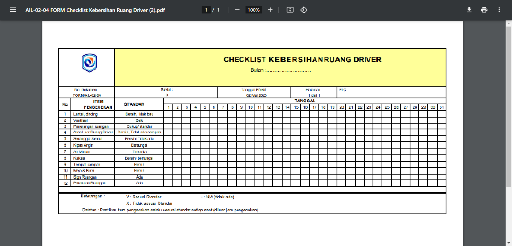
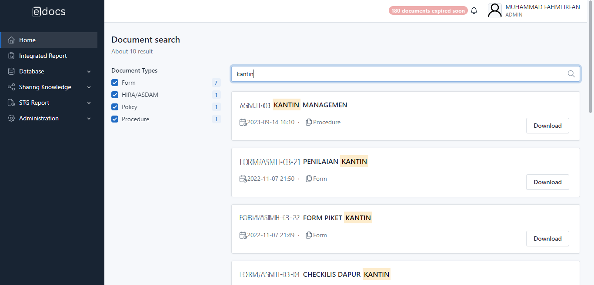

# E-DOCUMENT

## Description

This project serves as a centralized repository within a corporate setting, housing a wide array of documents such as forms, procedures, policies, certificates, and reports. It empowers employees to swiftly search, access, and download necessary documents. Featuring a robust search function, it enables seamless document retrieval, ensuring access permissions are in place for specific documents, thereby streamlining the document management process while maintaining security and accessibility for authorized personnel.

⚠️ **Disclaimer**: This is not a complete project. Some code is not included and is intended solely for demonstration purposes as part of a portfolio. You can find the excluded files by checking the [.gitignore](.gitignore) file.

## Technologies Used

- **Backend**: Codeigniter 3 (RESTful), Node.js for background notification scheduling
- **Frontend**: jQuery, Bootstrap
- **Database**: Microsoft SQL Server
- **Authentication**: JWT
- **Pagination**: SQL seek method for paginated tables
- **Search**: ElasticSearch for robust search functionality

## Features

- **CRUD Operations for Documents**: Enables document uploading of various types like doc, xls, ppt, pdf. Users can update, delete, and set document expiration if required.
- **Authorization Management**: Specifies document access, determining eligible departments or individuals. Defines user roles for viewing, downloading, adding, editing, deleting, or a combination of these actions.
- **Document Preview**: Allows document preview without downloading.
- **Document Download**: Permits downloading documents to the local storage.
- **Search Capability**: Utilizes Elasticsearch to facilitate user-friendly document searches.
- **Notification Feature**: Sends notifications through the interface or email when documents approach their expiration date. Notifications are sent regularly in the final month, starting from monthly and increasing to weekly in the last month (e.g., H-90 to H-7).
- **Activity Log**: Records user activity, tracking views, downloads, additions, updates, and deletions.

## Screenshots

### 1. CRUD Operations for Documents

  
   Image 1.1. - Crud document

  
   Image 1.2. - Add document

  
   Image 1.3. - Delete document

### 2. Authorization Management

  
   Image 2.1. - Choose departments

  
   Image 2.2. - Choose role

### 3. Document Preview

  
   Image 3. - Preview document

### 4. Document Download

  
   Image 4. - Download document

### 5. Search Capability

  
   Image 5. - Search document

### 6. Notification Feature

  
   Image 6.1. - Interface notifications

  
   Image 6.2. - Email notifications

### 7. Activity Log

  
   Image 7. - Activity log

## Support and Contact
For any support or feedback, please contact us at mfahmiirfan@gmail.com.
